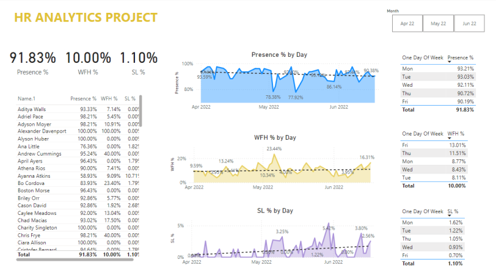

# HR Analytics Project
---

## Introduction

This HR analytics project focuses on analyzing employee presence data from **AtliQ Technologies**, a real-world company. The goal of this project was to build a comprehensive Power BI dashboard that provides valuable insights into employee attendance and behavior patterns. 
We collaborated closely with an HR representative from AtliQ Technologies to understand her specific requirements and tailor the dashboard to meet the company's needs.

## Problem Statement

- Employee Presence Tracking:
    - How can AtliQ Technologies accurately monitor employee presence on a daily basis?
    - What percentage of employees are present at work, working from home (WFH), or on sick leave (SL) during different months?

- Work From Home (WFH) Trends:
    - What are the trends in WFH percentages across different days of the week?
    - Are there specific days where employees prefer to work from home, and how does this impact overall presence in the office?

- Sick Leave Analysis:
    - How frequently are employees taking sick leave, and is there a pattern or increase in sick leave over time?
    - On which days of the week is sick leave most commonly taken, and how does it correlate with employee presence and WFH percentages?

- Employee-Specific Insights:
    - Which employees have the highest and lowest presence percentages, and how does this compare across the company?
    - How does individual employee attendance correlate with overall team or department performance?
      
- Month-over-Month Comparison:
    - How do employee presence, WFH, and sick leave percentages change over the course of three months (April, May, June 2022)?
    - Can any significant trends or anomalies be identified when comparing month-over-month data?

## Skills and Technologies Used:

- Power BI:
   - Dashboard Design: Created an interactive and visually appealing HR analytics dashboard to provide insights into employee presence, WFH trends, and sick leave patterns.
   - Data Modeling: Built a robust data model to accurately reflect relationships between different data sources, ensuring accurate and meaningful analysis.
   - Measures and Calculations: Utilized DAX (Data Analysis Expressions) to create custom measures, such as Presence %, WFH %, and SL %, to derive key metrics for the dashboard.
   - Time Intelligence: Applied DAX functions for time-based calculations, enabling comparisons across different time periods (e.g., month-over-month analysis).
   - Conditional Formatting: Enhanced visualizations with conditional formatting to highlight trends, outliers, and key performance indicators (KPIs).
   - Interactive Filters: Implemented slicers and filters to allow HR professionals to interact with the dashboard and customize views based on their needs (e.g., filtering by month or day of the week).

- DAX (Data Analysis Expressions):
   - Calculated Columns: Created calculated columns to derive additional insights, such as day of the week and month names from date fields.
   - Measures: Developed measures for dynamic calculations, including overall presence, WFH, and SL percentages, as well as daily and monthly aggregations.
   - Time Intelligence: Leveraged DAX functions like TOTALYTD, DATESMTD, and PREVIOUSMONTH to analyze data trends over specific time frames.

- Data Transformation:
   - Power Query: Utilized Power Query to clean and transform raw data, ensuring it was in the correct format for analysis.
   - Data Import: Imported data from various sources into Power BI, ensuring seamless integration for analysis.
     
- Visualization Techniques:
   - Line Charts: Used line charts to track daily trends in employee presence, WFH, and SL percentages over time.
   - Bar Charts: Employed bar charts to compare WFH and SL percentages across different days of the week.
   - Tables: Displayed detailed employee-level data with calculated presence, WFH, and SL percentages for granular analysis.

- Data Modeling:
   - Relationship Management: Defined and managed relationships between tables in the data model to ensure accurate reporting and analysis.
   - Measure Table Creation: Organized custom measures into a dedicated measure table for better project structure and management.

## Analysis:

 

- Employee Presence Tracking:

  
  
   - **Overall Presence**: The dashboard shows an average presence of 91.83% across the selected months, indicating strong attendance overall.
   - **Daily Presence Trend**: The "Presence % by Day" line chart reveals fluctuations in daily attendance. Notable dips in presence can be observed around early May and mid-June, where the presence percentage 
     dropped to 77.32% and 86.14%, respectively.
   - **Detailed Employee Presence**: A detailed table presents each employee's presence percentage, allowing HR to identify employees with consistently high or low attendance. For example, employees like Aditya 
     Walls and Adriel Pace maintained a presence above 93%, while others had lower attendance.
     
-  Work From Home (WFH) Trends:

   - **WFH Percentage**: The average WFH percentage across the dataset is 10.00%.
   - **WFH Trend by Day**: The "WFH % by Day" line chart highlights days with peaks in WFH activity, such as May 2022, where the WFH percentage reached 23.44%.
   - **Weekly WFH Patterns**: The table on the right side of the dashboard shows that Friday is the most common day for WFH, with an average of 13.01%. This insight helps HR understand potential patterns in 
      employee work preferences.
     
